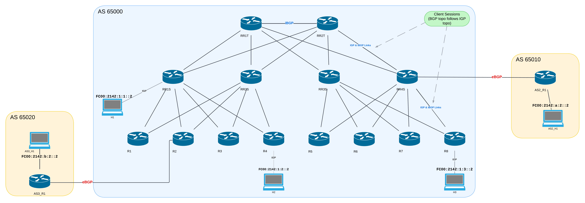
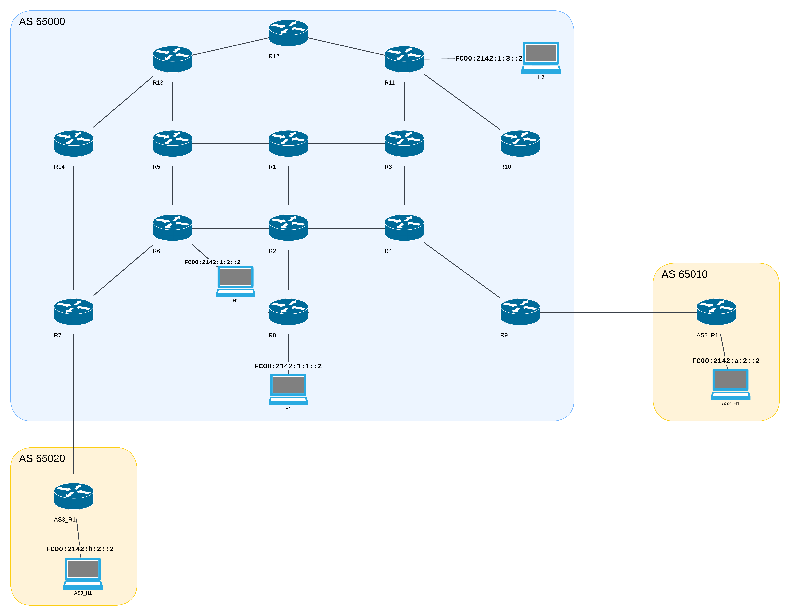

# BGP Route Reflector Hierarchy

**Group 3**: Thomas Juan, Detry Corentin

## Introduction

This lab is designed to showcase BGP Route Reflection in a hiearchical design using FRRouting and containerlab (IPv6 only).

## Route Reflector Hierarchy Topology

Our main AS (65000) has 2 Top Level Route Reflectors (RR1T and RR2T) connected in full mesh with each other, then we have 4 Second Level Route Reflectors (RR1S->RR4S), both connected to each top level route reflectors but not in full mesh with the others.

Finally we have 8 regular BGP routers (R1->R8), each connected to 2 second level route reflectors for redundancy.

As you can see on the diagram, the BGP topology follows the IGP topology.

We have 2 external ASes (65010 and 65020) connected to our main AS:
- AS 65010 is connected to RR4S, and has a host (AS2_H1, address: `fc00:2142:a:2::2`) connected to it.
- AS 65020 is connected to R2, and has a host (AS3_H1, address: `fc00:2142:b:2::2`) connected to it.

There are three hosts in our AS:
- H1 connected to RR1S (Host address: `fc00:2142:1:1::2`)
- H2 connected to R4 (Host address: `fc00:2142:1:2::2`)
- H3 connected to R8 (Host address: `fc00:2142:1:3::2`)

The hosts are reachable from any router/host in any AS.

## Full Mesh Topology

To be able to compare the performances of the Route Reflector Hierarchy with a full mesh topology, we also created a full mesh topology with the same ASes and hosts.

The diagram shows all the IGP links between the routers, for clarity we opted to not show the BGP sessions since we know that in a full mesh topology, all routers of an AS/Area are connected to each other using iBGP.

There is the same number of routers, but the number of IGP links is not exactly the same.

There are still 2 external ASes (65010 and 65020) connected to our main AS:
- AS 65010 is connected to R9, and has a host (AS2_H1, address: `fc00:2142:a:2::2`) connected to it.
- AS 65020 is connected to R7, and has a host (AS3_H1, address: `fc00:2142:b:2::2`) connected to it.

There are three hosts in our AS:
- H1 connected to R8 (Host address: `fc00:2142:1:1::2`)
- H2 connected to R6 (Host address: `fc00:2142:1:2::2`)
- H3 connected to R11 (Host address: `fc00:2142:1:3::2`)

## Configuration Generation Script
For the Route Reflector Hierarchy, we used a script to generate the configurations of the routers.

Our router configurations are created using the `./scripts/generate_configs.py` script (it is not meant to be called directly, see later). This script uses the `jinja` template engine to create configurations from the `templates` directory.

This simplifies the generation of router configurations and makes it easy to change them. Instead of manually modifying each router's configurations, we can simply modify the templates and rerun the script.

We started this lab by configuring the routers manually to make sure that everything worked, then after lots of small errors due to mismatched configurations, we decided to automate the process.
The templates are not super readable, so we still advise you to read the configurations manually to understand what is going on.

We didn't use the script for the full mesh topology since it is the templates do make it hard to create a unique configuration for each router without being too complex.

## Running the lab

We created a few different scripts to make it easier to run the lab, connect to routers, and test the connectivity and path diversity.

### Starting the lab
Start the lab using the `start.py` script (with `python3 start.py [ARGS]` or `./start.py [ARGS]` - you might need to run `chmod +x ./start.py` first).

**Positional Arguments (required, first argument)**:
- _hierarchy_: Start the Route Reflector Hierarchy lab
- _full-mesh_: Start the Full Mesh lab

**-> You must choose one of these two options.**

**Optional Arguments**:
-  _-h, --help_               :  show a help message and exit
-  _-c, --clean-only_         :  Clean up previous lab deployments and exit (Default: False)
-  _-s, --stop-previous_      :  Stop any previous lab deployment before starting (Default: True)
-  _-v, --verbose_            :  Enable verbose output (Default: False)
-  _-r, --rebuild_rr_configs_ :  Rebuild the RR configurations (Default: False)
-  _-a, --allow-multiple_     :  Allow multiple containers to run at the same time (_NOT RECOMMENDED_) (Default: False)

If the docker image for the host is not built, the script will build it for you the first time.

### Stopping the lab
You can stop the lab by using the `-c` or `--clean-only` flag with the `start.py` script (you need to pass in a lab type as well but it doesn't matter which one, the `c` option will stop both labs anyways).

### Connecting to a router

You can easily connect to a router using the `connect.py` script (called with `python3 connect.py ROUTER_NAME` or `./connect.py ROUTER_NAME`), e.g. `./connect.py RR1T` if the hierarchy lab is running.

You can specify the lab type with the `-l` or `--lab` flag, e.g. `./connect.py RR1T -l hierarchy` or `./connect.py R1 --lab full-mesh`.
This argument is optional, **if you don't specify it, the script will try to connect to the first lab it finds running.**

### Testing Connectivity and Path Diversity

You can test that all the routers can reach all the hosts (from any AS) as well as the path diversity using the `./launch_tests.py` script (called with `python3 launch_tests.py` or `./launch_tests.py`).

This script also has the lab as an optional argument, it functions in the same way as the `connect.py` script, if you don't specify the lab, it will try to connect to the first lab it finds running.

This test script will go one by one through all the routers and test the connectivity to all the hosts, then it will test the path diversity of the current topology on the central router (RR1T for the hierarchy lab, R1 for the full mesh lab).

To make full use of this script you should compare the results of the full mesh and hierarchy labs: First run the full mesh lab, launch the tests, then run the hierarchy lab and run the tests again. After each run, the tests results are saved, and the script will compare the results of the two labs at the end.
