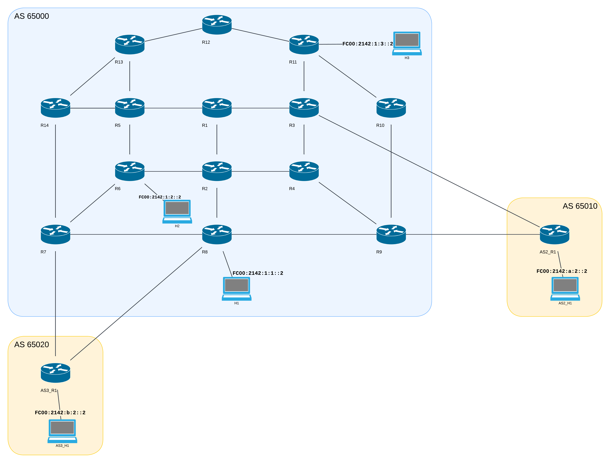

# BGP Route Reflector Hierarchy Lab

Authors (**Group 3**):
- Detry Corentin
- Thomas Juan

## Introduction

This lab is designed to showcase BGP Route Reflection in a hiearchical design using FRRouting and containerlab (IPv6 only).

## Route Reflector Hierarchy BGP Topology

The BGP topology of the Route Reflector Hierarchy created for this lab is illustrated below.

The complete topology (IGP + iBGP + eBGP) is shown in the diagram below.

Our main AS (65000) has 2 Top Level Route Reflectors (R1 and R2) connected in full mesh with each other, then we have 4 Second Level Route Reflectors (R3->R6), both connected to each top level route reflectors but not in full mesh with the other second level RRs.

Finally we have 8 regular BGP routers (R7->R14), each connected to 2 second level route reflectors for redundancy.

We have 2 external ASes (65010 and 65020) connected to our main AS:
- AS 65010 is connected to R9 and R3, and has a host (AS2_H1, address: `fc00:2142:a:2::2`) connected to it.
- AS 65020 is connected to R7 and R8, and has a host (AS3_H1, address: `fc00:2142:b:2::2`) connected to it.

There are three hosts in our AS:
- H1 connected to R8 (Host address: `fc00:2142:1:1::2`)
- H2 connected to R6 (Host address: `fc00:2142:1:2::2`)
- H3 connected to R11 (Host address: `fc00:2142:1:3::2`)

The hosts are reachable from any router/host in any AS.

We chose to establish an eBGP peering between AS 65010 and R3 because we wanted to show the non optimal path being chosen by R3 (as it is a RR itself) for prefixes from AS 65010.

The configuration files for this topology are in the clab-scenario-better-hierarchy directory (the reasons for the name will be explained later).

## Full Mesh iBGP Topology

To be able to compare the performances of the Route Reflector Hierarchy with a Full Mesh iBGP topology, we took the underlying IGP topology of the Route Reflector Hierarchy and configured the routers to be in Full Mesh iBGP instead. 

The diagram above shows all the IGP links between the routers, **for clarity we opted to not show the BGP sessions since we know that in a full mesh topology, all routers of an AS/Area are connected to each other using iBGP**.

There is the same number of routers, but the number of IGP links is not exactly the same.

There are still 2 external ASes (65010 and 65020) connected to our main AS:
- AS 65010 is connected to R9, and has a host (AS2_H1, address: `fc00:2142:a:2::2`) connected to it.
- AS 65020 is connected to R7, and has a host (AS3_H1, address: `fc00:2142:b:2::2`) connected to it.

There are three hosts in our AS:
- H1 connected to R8 (Host address: `fc00:2142:1:1::2`)
- H2 connected to R6 (Host address: `fc00:2142:1:2::2`)
- H3 connected to R11 (Host address: `fc00:2142:1:3::2`)

The configuration files for this topology are in the clab-scenario-full-mesh directory.

<!-- ## Configuration Generation Script
For the Route Reflector Hierarchy, we used a script to generate the configurations of the routers.

Our router configurations are created using the `./scripts/generate_configs.py` script (it is not meant to be called directly, see later). This script uses the `jinja` template engine to create configurations from the `templates` directory.

This simplifies the generation of router configurations and makes it easy to change them. Instead of manually modifying each router's configurations, we can simply modify the templates and rerun the script.

We started this lab by configuring the routers manually to make sure that everything worked, then after lots of small errors due to mismatched configurations, we decided to automate the process.
The templates are not super readable, so we still advise you to read the configurations manually to understand what is going on.

We didn't use the script for the full mesh topology since it is the templates do make it hard to create a unique configuration for each router without being too complex. -->

## Running the lab

We created a few different scripts to make it easier to run the lab, connect to routers, and test the connectivity and path diversity.

### Starting the lab
Start the lab using the `start.py` script (with `python3 start.py [ARGS]` or `./start.py [ARGS]` - you might need to run `chmod +x ./start.py` first).

**Positional Arguments (required)**:
- _better-hierarchy_: Start the Route Reflector Hierarchy lab
- _full-mesh_: Start the Full Mesh lab

**-> You must choose one of these two options.**

**Optional Arguments**:
-  _-h, --help_               :  show a help message and exit
-  _-c, --clean-only_         :  Clean up previous lab deployments and exit (Default: False)
-  _-s, --stop-previous_      :  Stop any previous lab deployment before starting (Default: True)
-  _-v, --verbose_            :  Enable verbose output (Default: False)
-  _-a, --allow-multiple_     :  Allow multiple labs to run at the same time (_Not recommended, could break the test scripts_) (Default: False)

If the docker image for the host is not built, the script will build it for you the first time.

### Stopping the lab
You can stop the lab by using the `-c` or `--clean-only` flag with the `start.py` script (you need to pass in a lab type as well but it doesn't matter which one, the `c` option will stop both labs anyways).

### Connecting to a router

You can easily connect to a router using the `connect.py` script (called with `python3 connect.py ROUTER_NAME` or `./connect.py ROUTER_NAME`), e.g. `./connect.py R1` if the better-hierarchy lab is running.

You can specify the lab type with the `-l` or `--lab` flag, e.g. `./connect.py R1 -l better-hierarchy` or `./connect.py R1 --lab full-mesh`.
This argument is optional, **if you don't specify it, the script will try to connect to the running lab.**

### Test scripts

To evaluate the performance of the Route Reflector Hierarchy compared to the Full Mesh topology, we created a test script that will first test the connectivity of all the routers and hosts, then it will compute the path diversity in the topology, and then it will crash a central router (R3) to measure the time it takes for BGP to converge.

Start the script by running `python3 launch_tests.py [lab_name (optional)]` or `./launch_tests.py [lab_name]`.

It will first check if BGP has already converged (it does so by checking if R7 can ping both external hosts), if it hasn't converged yet, it will wait.

Then it will check if each router can ping each (internal and external) host.

After that, it will compute the path diversity in the topology.

Finally, it will crash R3 and measure the time it takes for BGP to converge.

## Graphs and Results
To create the graphs shown below, we developed a script that starts a lab, runs the tests, stops the lab, then starts another lab and runs the tests on that lab. This script is called `make_graphs.py` and can be run with `python3 make_graphs.py` or `./make_graphs.py`.

The graphs are saved in the `images` directory.

### Path Diversity

The first graph shows the average path diversity in the topology. The path diversity is the number of unique paths that a packet can take from one router to another. The higher the path diversity, the more redundant the network is.

Since each route reflector runs the BGP decision process, it will choose the best path to a destination, and this path will be the same for all routers connected to the route reflector. This means that the path diversity will be lower in the Route Reflector Hierarchy than in the Full Mesh topology.

This is verified by the graph below, which shows that the path diversity is higher in the Full Mesh topology than in the Route Reflector Hierarchy. The path diversity here is measured on router R10 because it is connected to R3 wihch is a route reflector with an eBGP peering link to AS 65010, and R3 itself has as a client R9 which also has an eBGP peering link to AS 65010.

We show the average number of unique paths between all the routers, because since each router is connected to 2 route reflectors, the number of paths is higher (each router receives one path per RR, but that path is not necessarily unique).

### BGP Convergence Time after Router Failure

The second graph illustrates the time required for BGP to converge after a central router (R3, Second Level RR in the RR Hierarchy) crashes. Convergence time refers to the time it takes for all routers to have a similar and fixed view of the network. In this case, we measure the time it takes for Router R10 to update its RIB regarding the external prefix(es) from AS 65010. This is because the crashed router R3 has a peering link with AS 65010, and R9 also maintains a peering link with AS 65010, measuring the time it takes for R10 to update its RIB is therefore quite interesting.

In the Route Reflector Hierarchy, the convergence time is, in fact, lower than in the Full Mesh topology. This is (most likely) due to fewer BGP sessions in the Route Reflector Hierarchy, allowing route reflectors to propagate network changes more rapidly than in the Full Mesh topology.

## Sources

Here are most of the sources that we used to create this lab:
- [RFC 4456 - BGP Route Reflection](https://datatracker.ietf.org/doc/html/rfc4456) 
- [Cisco - Configuring Internal BGP Features](https://www.cisco.com/c/en/us/td/docs/ios-xml/ios/iproute_bgp/configuration/xe-16/irg-xe-16-book/configuring-internal-bgp-features.html)
- [Cisco - Examine Border Gateway Protocol Case Studies](https://www.cisco.com/c/en/us/support/docs/ip/border-gateway-protocol-bgp/26634-bgp-toc.html)
- [Cisco - Examine Border Gateway Protocol Frequently Asked Questions](https://www.cisco.com/c/en/us/support/docs/ip/border-gateway-protocol-bgp/5816-bgpfaq-5816.html)
- [FRRouting - BGP Documentation](https://docs.frrouting.org/en/latest/bgp.html)
- [FRRouting - Route Maps Documentation](https://docs.frrouting.org/en/latest/routemap.html)
- [FRRouting - IS-IS Documentation](https://docs.frrouting.org/en/latest/isisd.html)
- [uni-koeln - FRRouting Basic IS-IS Router Configuration](https://www.uni-koeln.de/~pbogusze/posts/FRRouting_basic_IS-IS_router_configuration.html)
- [ETH Zurich - Configure BGP](https://gitlab.ethz.ch/nsg/public/comm-net-2022-routing-project/-/wikis/2.-Tutorial/2.5-Configuring-IP-routers/2.5.5-Configure-BGP)
